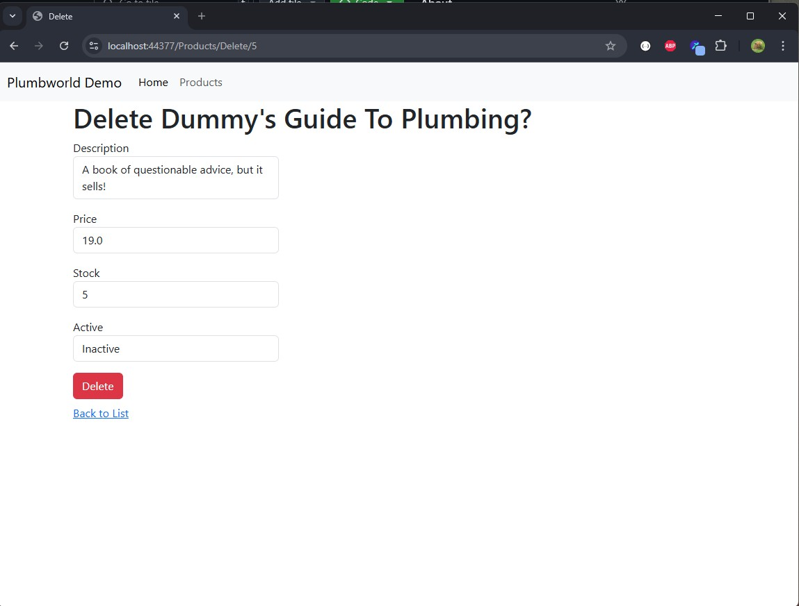

# PlumbworldDemo

This is Peter Bellaby's response to the ASP.NET Developer Technical Challenge after 4 hours of development (separated over 4 days due to professional and family commitments). I wrote this README.MD, and sourced the screenshots, after the 4 hour limit.

It is built using an empty Microsoft C# Web Api template, using C#.NET 9 ASP MVC core with Entity Framework and Sqlite. Bootstrap 5.2 is also used. 

## Core Objective
To "build an internal admin interface and API for managing a product catalogue".

The site should:
1. View a list of products (a.k.a. Read)
2. Filter/search products
3. Create, Update, and Delete products

I'll let you be the judge of that.

## Installation
These instructions assume a basic understanding of git and Visual Studio.

```bash
git clone https://github.com/Tamillis/PlumbworldDemo.git
```

When inside the project with Visual Studio, use the Package Manager Console (PMC) to run the initial migraition.

```pmc
# The EF Tools package should already be present as a dependency, but if not install it with
Install-Package Microsoft.EntityFrameworkCore.Tools

# Then
Update-Database
```

Finally, click run within Visual Studio. You may need to explicitly set the startup option to "IIS Express".

## Site Walkthrough & Requirement Completion

There is a simple landing page:


Navigate via the topbar to the products page. This page shows all products verbatim, as well as the filter to search by (requirements #1 & #2).


Filtering for "plunge" shows the correct result. A note on the active / inactive toggles, they're both there (and cannot both be active together due to a snippet of JS) to allow for searches that are active only, inactive only, or both.


Here is the update page using the wrench item:


The delete page of the dummys guide item is a different page, showing only in text the item's details, functioning as a confirmation page.



Clicking create brings you to the Create page, which is actually exactly the same page as the update page, just with a glossed route and a model with default values.


And here you can see the created item on the main list, and the deleted item missing:


The above completes requirement #3.

## Code Evaluation

### MVC Architecture
The project uses typical Model View Controller architecture, alongside ASP.NET's use of shared view layouts


### Dependency Injection & Repository pattern
`Program.cs` shows the setup of dependency injection, ASP takes care of the implementation for us, the required objects magically appear in our constructors. This is also where I seed the initial database should it be empty, only if it is the development environment.


You will notice one of the dependencies is a service layer, `ProductsService.cs`, a.k.a. the Repository pattern. Note the IQueryable type for the Products property, this allows dynamic query building on the controller side, dependent on passed in parameters, and a single efficient call to the database. A bit overkill for such a tiny embedded db like this one, but very handy on large production databases.


### Unit Testing with Moq
I have used Moq to stub out the Entity Framework context and test the Service independently, which is what the "PlumbworldDemoTests" project contains. I would have tested the webpage results themselves using Selenium and a web crawler but time constraints...


This test file goes on so please look at it directly.

## Closing Comments
It was nice to work within the most modern version of .NET again, and to re-familiarise myself with how the modern tooling works. It took a reasonable amount of time to get set up using the blank template and some help from the documentation. One of the biggest time sinks by far was using Moq as I hadn't in over a year and a half, so I lost more time there than I thought.

It means the other pages were not as detailed as I'd liked, as I was focusing more on good clean code underneath. The UI is... bootstrap basic let's say. I'd have loved to have added quality of life features like column sorting, pagination, navigation and better user guidance (the UI currently very much assumes the users knows what they're looking at).

I also had a plan to incorporate a login page with basic cookie-based authentication and authorisation that I've used before and in theory could just port over, but I didn't in the end have time. It was always a "in case I have extra time" idea anyway.

I purposefully didn't make use of my JS framework `Tablemaker.js`, which would have given me lovely easy-to-use tables (from the user's perspective) but I figured that would be cheating in a way. You can always check it out here: [https://github.com/Tamillis/MyTools/tree/main/TableMaker](https://github.com/Tamillis/MyTools/tree/main/TableMaker)

I hope this challenge has been completed to your satisfaction
